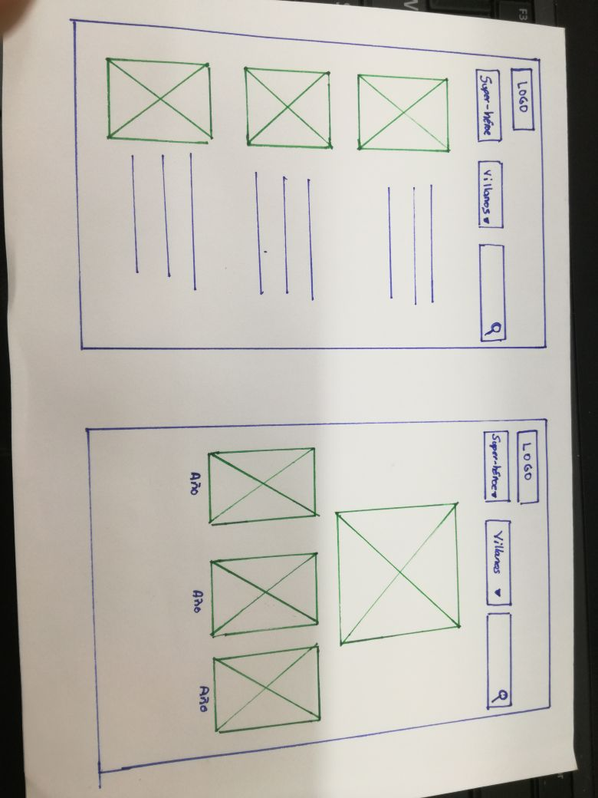

 ## **HACKATHON: "MARVEL VS DC COMICS"**

 ## **Desarollo  del proyecto**
 

Se realizó una lluvia de ideas para ver que tema  se podría realizar, Una  vez definido  se empezó a indagar y buscar todo la información referente, para identificar que el tema era  viable.

Para crear la aplicación se realizaron  entrevistas face to face y breves encuestas a diversas personas.

## **Prototipos iniciales**

## **Descripción del producto a realizar**

Hoy en día hemos visto que soñar  con ser un personaje de alguna pelicula  no  es ir muy lejos, y que mejor ser  un personaje  que pertenesca a Dc Comics o Marvel. Con la aplicacion  que  desarollaremosexiste una aplicación que ayude a definir que disfraz  poder usar  
Marvel vs Dc trata  de dar una idea a las personas de como disfrazarce  de acuerdo al personaje que  eligan. De acuerdo

## **Objetivo**

INTEGRANTES:
            Paola Flores
            Liliam Haro
            Nataly Otero
            Maria Teresa Ruiz

  

;

4.HERRAMIENTAS UTILIZADAS
-JQUERY
-BOOSTSTRAP
-MATERIALIZE
-HTML5
-css3
-Firebase
