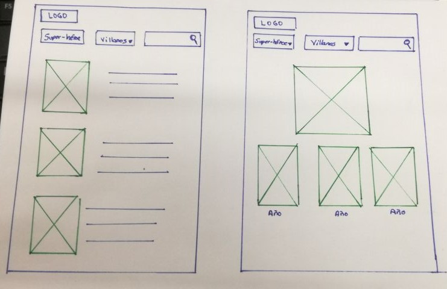
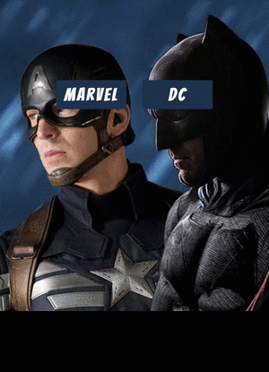

 ## **HACKATHON: "MARVEL VS DC COMICS"**

 ## **Desarollo  del proyecto**
 

Se realizó una lluvia de ideas para ver que tema  se podría realizar, Una  vez definido  se empezó a indagar y buscar todo la información referente, para identificar que el tema era  viable.

Para crear la aplicación se realizaron  entrevistas face to face y breves encuestas a diversas personas.

## **Planificación**

## **Prototipos iniciales**

## **Producto final**

## **Descripción del producto a realizar**

Hoy en día hemos visto que soñar con ser un personaje de alguna película no es ir muy lejos, y que mejor el poder representar a un personaje perteneciente a Dc Comics o Marvel. Con la aplicación web que vamos a desarrollar; ayudará a definir cómo te podrías disfrazar, tener la opción de elegir ser un super-héroe o villano. Presentaremos todas las películas en las que tu personaje participó, dándote una idea de la evolución de vestuario y accesorios que tuvo, y presentándote las películas en las aparece con una breve descripción de cada una.

## **Objetivo**
 * Darle al usuario  una experiencia satisfactoria tanto visual y funcional.
 * Brindarle información al usuario del personaje de pelicula que eligió en tiempo real.
 * La aplicación tendrá versión móvil y desktop para que sea accesible desde cualquier parte donde se esté.

## **Integrantes**

  * Paola Flores
  * Lilliam Haro
  * Nataly Otero
  * Maria Teresa Ruiz
          

## **Herramientas utilizadas**
  * JQUERY
  * Materialize
  * HTML5
  * CSS3
  * OMNb API
